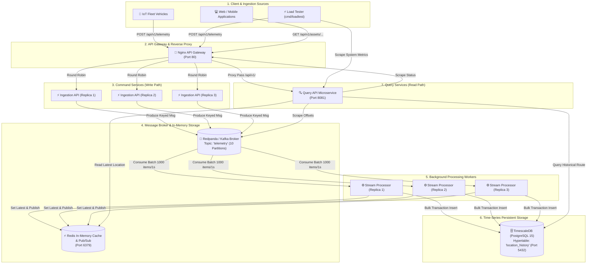
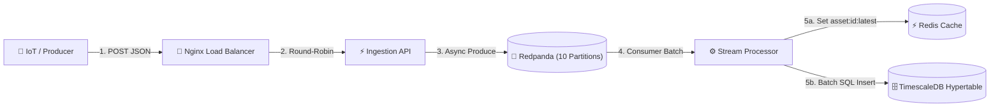

# Project Architecture Documentation

## 1. Overview
- **Project Name:** Fleet Tracker (High-Throughput Fleet Tracking Backend)
- **Purpose:** A distributed, event-driven time-series ingestion and querying backend designed to process high-frequency GPS telemetry (latitude, longitude, timestamp) from tens of thousands of concurrent active fleet vehicles with low latency, high availability, and zero data loss.
- **Tech Stack:**
  - **Language:** Go (Golang 1.25)
  - **HTTP Framework:** Gin Web Framework (`github.com/gin-gonic/gin`)
  - **API Gateway & Load Balancer:** Nginx (Layer 7 reverse proxy & round-robin load balancer)
  - **Message Broker & Streaming:** Redpanda (Kafka-compatible event streaming, 10-partition topic) via `github.com/segmentio/kafka-go`
  - **In-Memory Cache & Pub/Sub:** Redis 7 (`github.com/redis/go-redis/v9`)
  - **Time-Series Database:** TimescaleDB (PostgreSQL 15 extension) via `github.com/jackc/pgx/v5`
  - **Containerization & Orchestration:** Docker & Docker Compose
  - **Load Testing & Observability:** Custom Go multi-threaded load generator (`cmd/loadtest`) and real-time observability scraping metrics endpoint.
- **High-Level Summary:**
  The High-Throughput Fleet Tracking System implements a Command Query Responsibility Segregation (CQRS) event-driven architecture to isolate high-volume write operations from low-latency read requests. Incoming telemetry data from IoT devices or load testers is reverse-proxied by Nginx across multiple Ingestion API microservices, which validate payloads and asynchronously publish events to a 10-partition Redpanda/Kafka topic. Scalable Stream Processor workers consume telemetry in batches, maintaining real-time vehicle state in Redis and performing bulk transaction inserts into TimescaleDB hypertables for long-term historical route tracking. Query API microservices serve real-time asset locations from Redis and historical route data from TimescaleDB while serving a unified system health and metrics dashboard.

---

## 2. Folder Structure

```
high-throughput-tracker-backend/
├── api-gateway/                 → Nginx reverse proxy configuration & Dockerfile for API routing and load balancing
│   ├── Dockerfile               → Docker image build file for Nginx API gateway
│   └── nginx.conf               → Nginx configuration for upstream clusters (/api/v1/telemetry and /api/v1/)
├── cmd/                         → Application entry points for microservices and tools
│   ├── ingestion-api/           → HTTP Ingestion microservice (Write path / Command side)
│   │   ├── Dockerfile           → Container build definition for ingestion API
│   │   └── main.go              → Entry point for receiving REST telemetry and producing to Kafka
│   ├── loadtest/                → High-concurrency load testing utility
│   │   ├── Dockerfile           → Container build definition for load testing container
│   │   └── main.go              → Multi-threaded load generator (200 workers, 100k assets) and observability scraper
│   ├── query-api/               → HTTP Read microservice (Read path / Query side & system metrics)
│   │   ├── Dockerfile           → Container build definition for query API
│   │   └── main.go              → Entry point for fetching asset location, route history, and health metrics
│   └── stream-processor/        → Event stream processing worker (Background consumer)
│       ├── Dockerfile           → Container build definition for stream processor
│       └── main.go              → Entry point for consuming Kafka batches, writing to Redis, and persisting to TimescaleDB
├── db/                          → Database initialization scripts and schema definitions
│   └── init.sql                 → SQL script initializing TimescaleDB extension, assets table, hypertable, index, and compression/retention policies
├── internal/                    → Private application code shared across microservices
│   ├── domain/                  → Core domain models and interface contracts
│   │   ├── models.go            → Data models for Asset and Telemetry
│   │   └── repositories.go      → Interfaces defining TelemetryProducer, TelemetryCache, and TelemetryStorage
│   ├── kafka/                   → Kafka infrastructure adapter using segmentio/kafka-go
│   │   ├── consumer.go          → Batch Kafka consumer with error handling and manual offset committing
│   │   └── producer.go          → High-throughput Kafka producer with key-based partitioning
│   ├── postgres/                → PostgreSQL / TimescaleDB infrastructure adapter using jackc/pgx/v5
│   │   └── storage.go           → Batch insertion, time-range route queries, and hypertable metrics querying
│   └── redis/                   → Redis cache & Pub/Sub adapter using go-redis/v9
│       └── cache.go             → Key-value storage for latest asset locations, Pub/Sub broadcasting, and Redis metrics
├── .gitignore                   → Git exclusion rules for environmental secrets, binaries, and logs
├── ARCHITECTURE.md              → System architecture documentation
├── docker-compose.yml           → Orchestration for Redpanda, Redis, TimescaleDB, API Gateway, 3x Ingestion, 3x Stream Processors, Query API, and Load Tester
├── go.mod                       → Go module definition and dependency declarations
├── go.sum                       → Go dependency checksum file
├── README.md                    → Project overview, architecture diagrams, performance metrics, and setup instructions
└── run-loadtest.ps1             → PowerShell script for executing the Docker-based load test container
```

---

## 3. Component Breakdown

### 1. API Gateway (Nginx)
- **Name:** API Gateway
- **Location:** [api-gateway/](file:///d:/projects/through-put-using-kafka/high-throughput-tracker-backend/api-gateway) ([nginx.conf](file:///d:/projects/through-put-using-kafka/high-throughput-tracker-backend/api-gateway/nginx.conf), [Dockerfile](file:///d:/projects/through-put-using-kafka/high-throughput-tracker-backend/api-gateway/Dockerfile))
- **Purpose/Function:** Serves as the central HTTP entry point (Port 80) for external clients. Load balances incoming POST telemetry requests (`/api/v1/telemetry`) across 3 Ingestion API replicas (`ingestion-api-1`, `ingestion-api-2`, `ingestion-api-3`) using round-robin. Proxies read queries (`/api/v1/`) to the Query API (`query-api:8081`). Exposes `/nginx_status` for stub status metrics scraping.
- **Depends on:** [Ingestion API Microservices](file:///d:/projects/through-put-using-kafka/high-throughput-tracker-backend/cmd/ingestion-api/main.go), [Query API Microservice](file:///d:/projects/through-put-using-kafka/high-throughput-tracker-backend/cmd/query-api/main.go)
- **Used by:** External IoT Fleet Devices, Web/Mobile Clients, [Load Tester](file:///d:/projects/through-put-using-kafka/high-throughput-tracker-backend/cmd/loadtest/main.go)

### 2. Ingestion API Microservice
- **Name:** Ingestion API
- **Location:** [cmd/ingestion-api/](file:///d:/projects/through-put-using-kafka/high-throughput-tracker-backend/cmd/ingestion-api) ([main.go](file:///d:/projects/through-put-using-kafka/high-throughput-tracker-backend/cmd/ingestion-api/main.go), [Dockerfile](file:///d:/projects/through-put-using-kafka/high-throughput-tracker-backend/cmd/ingestion-api/Dockerfile))
- **Purpose/Function:** The write-side Command endpoint (`POST /api/v1/telemetry`). Receives JSON payloads (`asset_id`, `latitude`, `longitude`), binds and validates input, appends UTC timestamp, and produces the payload to Kafka topic `telemetry`. Returns HTTP 202 (`Accepted`) immediately to ensure ultra-low latency for producers.
- **Depends on:** [internal/domain](file:///d:/projects/through-put-using-kafka/high-throughput-tracker-backend/internal/domain/models.go), [internal/kafka](file:///d:/projects/through-put-using-kafka/high-throughput-tracker-backend/internal/kafka/producer.go) (Producer), Redpanda / Kafka Cluster
- **Used by:** [API Gateway (Nginx)](file:///d:/projects/through-put-using-kafka/high-throughput-tracker-backend/api-gateway/nginx.conf)

### 3. Stream Processor Microservice
- **Name:** Stream Processor Worker
- **Location:** [cmd/stream-processor/](file:///d:/projects/through-put-using-kafka/high-throughput-tracker-backend/cmd/stream-processor) ([main.go](file:///d:/projects/through-put-using-kafka/high-throughput-tracker-backend/cmd/stream-processor/main.go), [Dockerfile](file:///d:/projects/through-put-using-kafka/high-throughput-tracker-backend/cmd/stream-processor/Dockerfile))
- **Purpose/Function:** Asynchronous background consumer running in consumer group `stream-processor-group`. Continuously pulls telemetry message batches (up to 1,000 messages or 1s window) from Kafka. Performs bulk SQL transaction inserts into TimescaleDB `location_history`, updates latest vehicle position in Redis (`asset:{id}:latest`), and broadcasts real-time updates over Redis Pub/Sub (`telemetry_updates`). Commits offsets upon success.
- **Depends on:** [internal/domain](file:///d:/projects/through-put-using-kafka/high-throughput-tracker-backend/internal/domain/models.go), [internal/kafka](file:///d:/projects/through-put-using-kafka/high-throughput-tracker-backend/internal/kafka/consumer.go) (Consumer), [internal/postgres](file:///d:/projects/through-put-using-kafka/high-throughput-tracker-backend/internal/postgres/storage.go) (Storage), [internal/redis](file:///d:/projects/through-put-using-kafka/high-throughput-tracker-backend/internal/redis/cache.go) (Cache), Redpanda / Kafka, Redis, TimescaleDB
- **Used by:** Redpanda / Kafka Broker (consumes topic events)

### 4. Query API Microservice
- **Name:** Query API
- **Location:** [cmd/query-api/](file:///d:/projects/through-put-using-kafka/high-throughput-tracker-backend/cmd/query-api) ([main.go](file:///d:/projects/through-put-using-kafka/high-throughput-tracker-backend/cmd/query-api/main.go), [Dockerfile](file:///d:/projects/through-put-using-kafka/high-throughput-tracker-backend/cmd/query-api/Dockerfile))
- **Purpose/Function:** The read-side Query REST service. Serves real-time vehicle locations (`GET /api/v1/assets/:id/location`) from Redis cache and historical route data (`GET /api/v1/assets/:id/route`) from TimescaleDB. Exposes a unified health and metrics endpoint (`GET /api/v1/system/metrics`) aggregate stats across TimescaleDB, Redis, Redpanda Kafka partitions, and Nginx.
- **Depends on:** [internal/postgres](file:///d:/projects/through-put-using-kafka/high-throughput-tracker-backend/internal/postgres/storage.go) (Storage), [internal/redis](file:///d:/projects/through-put-using-kafka/high-throughput-tracker-backend/internal/redis/cache.go) (Cache), Redis, TimescaleDB, Redpanda Kafka (via `kafka.Dial`), Nginx API Gateway (via HTTP scrape)
- **Used by:** [API Gateway (Nginx)](file:///d:/projects/through-put-using-kafka/high-throughput-tracker-backend/api-gateway/nginx.conf), [Load Tester](file:///d:/projects/through-put-using-kafka/high-throughput-tracker-backend/cmd/loadtest/main.go), Web/Mobile Clients

### 5. Domain Module
- **Name:** Domain Package
- **Location:** [internal/domain/](file:///d:/projects/through-put-using-kafka/high-throughput-tracker-backend/internal/domain) ([models.go](file:///d:/projects/through-put-using-kafka/high-throughput-tracker-backend/internal/domain/models.go), [repositories.go](file:///d:/projects/through-put-using-kafka/high-throughput-tracker-backend/internal/domain/repositories.go))
- **Purpose/Function:** Encapsulates core business data entities (`Asset`, `Telemetry`) and defines Go interfaces (`TelemetryProducer`, `TelemetryCache`, `TelemetryStorage`) establishing decoupling contracts for infrastructure abstractions.
- **Depends on:** Go Standard Library (`context`, `time`)
- **Used by:** [Ingestion API](file:///d:/projects/through-put-using-kafka/high-throughput-tracker-backend/cmd/ingestion-api/main.go), [Stream Processor](file:///d:/projects/through-put-using-kafka/high-throughput-tracker-backend/cmd/stream-processor/main.go), [Query API](file:///d:/projects/through-put-using-kafka/high-throughput-tracker-backend/cmd/query-api/main.go), [internal/kafka](file:///d:/projects/through-put-using-kafka/high-throughput-tracker-backend/internal/kafka), [internal/postgres](file:///d:/projects/through-put-using-kafka/high-throughput-tracker-backend/internal/postgres), [internal/redis](file:///d:/projects/through-put-using-kafka/high-throughput-tracker-backend/internal/redis)

### 6. Kafka Infrastructure Adapter
- **Name:** Kafka Adapter
- **Location:** [internal/kafka/](file:///d:/projects/through-put-using-kafka/high-throughput-tracker-backend/internal/kafka) ([producer.go](file:///d:/projects/through-put-using-kafka/high-throughput-tracker-backend/internal/kafka/producer.go), [consumer.go](file:///d:/projects/through-put-using-kafka/high-throughput-tracker-backend/internal/kafka/consumer.go))
- **Purpose/Function:** Wraps `segmentio/kafka-go`. Producer uses `LeastBytes` balancing and sets `Key = AssetID` to guarantee strict message ordering per vehicle partition. Consumer fetches message batches up to 10MB or 50ms wait times and manages manual message offset commits.
- **Depends on:** `github.com/segmentio/kafka-go`, [internal/domain](file:///d:/projects/through-put-using-kafka/high-throughput-tracker-backend/internal/domain/models.go)
- **Used by:** [Ingestion API](file:///d:/projects/through-put-using-kafka/high-throughput-tracker-backend/cmd/ingestion-api/main.go), [Stream Processor](file:///d:/projects/through-put-using-kafka/high-throughput-tracker-backend/cmd/stream-processor/main.go)

### 7. PostgreSQL / TimescaleDB Infrastructure Adapter
- **Name:** Postgres Storage Adapter
- **Location:** [internal/postgres/](file:///d:/projects/through-put-using-kafka/high-throughput-tracker-backend/internal/postgres) ([storage.go](file:///d:/projects/through-put-using-kafka/high-throughput-tracker-backend/internal/postgres/storage.go))
- **Purpose/Function:** Implements database operations over `pgxpool.Pool`. Executes transactional batch inserts (`InsertBatch`), queries historical route trajectories (`GetRouteHistory`), and collects TimescaleDB statistics (row counts, database size, connection counts, hypertable compression multiplier).
- **Depends on:** `github.com/jackc/pgx/v5`, [internal/domain](file:///d:/projects/through-put-using-kafka/high-throughput-tracker-backend/internal/domain/models.go)
- **Used by:** [Stream Processor](file:///d:/projects/through-put-using-kafka/high-throughput-tracker-backend/cmd/stream-processor/main.go), [Query API](file:///d:/projects/through-put-using-kafka/high-throughput-tracker-backend/cmd/query-api/main.go)

### 8. Redis Cache & Pub/Sub Adapter
- **Name:** Redis Cache Adapter
- **Location:** [internal/redis/](file:///d:/projects/through-put-using-kafka/high-throughput-tracker-backend/internal/redis) ([cache.go](file:///d:/projects/through-put-using-kafka/high-throughput-tracker-backend/internal/redis/cache.go))
- **Purpose/Function:** Manages Redis client connections using `go-redis/v9`. Stores latest asset position JSON under `asset:{id}:latest` with 24h TTL (`SetLatestLocation`), reads latest position (`GetLatestLocation`), broadcasts position events over channel `telemetry_updates` (`PublishLocation`), and collects Redis memory/ops metrics.
- **Depends on:** `github.com/redis/go-redis/v9`, [internal/domain](file:///d:/projects/through-put-using-kafka/high-throughput-tracker-backend/internal/domain/models.go)
- **Used by:** [Stream Processor](file:///d:/projects/through-put-using-kafka/high-throughput-tracker-backend/cmd/stream-processor/main.go), [Query API](file:///d:/projects/through-put-using-kafka/high-throughput-tracker-backend/cmd/query-api/main.go)

### 9. Load Testing Utility
- **Name:** Fleet Load Tester
- **Location:** [cmd/loadtest/](file:///d:/projects/through-put-using-kafka/high-throughput-tracker-backend/cmd/loadtest) ([main.go](file:///d:/projects/through-put-using-kafka/high-throughput-tracker-backend/cmd/loadtest/main.go), [Dockerfile](file:///d:/projects/through-put-using-kafka/high-throughput-tracker-backend/cmd/loadtest/Dockerfile), [run-loadtest.ps1](file:///d:/projects/through-put-using-kafka/high-throughput-tracker-backend/run-loadtest.ps1))
- **Purpose/Function:** High-concurrency benchmarking tool. Inserts 100,000 seed asset metadata rows into TimescaleDB, then spawns 200 concurrent worker goroutines bombarding the API Gateway with realistic GPS coordinates generated around 32 global geographic hubs for 60 seconds. Measures throughput (RPS), average latency, error breakdown, scrapes Query API system metrics, and appends structured reports to `loadtest_results.log`.
- **Depends on:** `github.com/jackc/pgx/v5`, [API Gateway](file:///d:/projects/through-put-using-kafka/high-throughput-tracker-backend/api-gateway/nginx.conf), [Query API](file:///d:/projects/through-put-using-kafka/high-throughput-tracker-backend/cmd/query-api/main.go), TimescaleDB
- **Used by:** System Engineers / Developers for benchmark validation

### 10. Database Initialization & Schema Definition
- **Name:** Database Schema & Init Script
- **Location:** [db/init.sql](file:///d:/projects/through-put-using-kafka/high-throughput-tracker-backend/db/init.sql)
- **Purpose/Function:** Bootstraps database environment on container startup. Enables `timescaledb` extension, creates standard relational `assets` table, creates `location_history` hypertable partitioned by 1-hour time chunks, sets composite index (`asset_id, time DESC`), configures automated columnar compression policies, continuous aggregate view `hourly_asset_stats`, and a 6-month retention policy.
- **Depends on:** TimescaleDB Database Engine
- **Used by:** TimescaleDB Container initialization (`/docker-entrypoint-initdb.d/init.sql`)

---

## 4. Architecture Diagram

### System-Level Combined Architecture Diagram



### Write Path (Command) Micro-Diagram



### Read Path (Query) Micro-Diagram

```mermaid
flowchart LR
    Client["💻 Client / Web App"] -->|1. GET /api/v1/assets/:id/location| QueryAPI["🔍 Query API"]
    QueryAPI -->|2a. O(1) Key Lookup| Redis[("⚡ Redis Cache")]
    Client -->|1b. GET /api/v1/assets/:id/route| QueryAPI
    QueryAPI -->|2b. Time-Range SQL Query| DB[("🗄️ TimescaleDB")]
    Client -->|1c. GET /api/v1/system/metrics| QueryAPI
    QueryAPI -->|2c. Collect System Health| AllComp["🔀 Nginx + Kafka + Redis + TimescaleDB"]
```

---

## 5. Data Flow Explanation

### 1. Write Path Flow (Telemetry Ingestion & Processing)
1. **Request Ingress:** An IoT vehicle device or load generator sends an HTTP `POST` request to `http://<host>/api/v1/telemetry` containing a JSON body:
   `{"asset_id": "asset-42", "latitude": 37.7749, "longitude": -122.4194}`.
2. **Reverse Proxying & Load Balancing:** Nginx receives the request on port 80 and uses upstream round-robin load balancing (`ingestion_cluster`) to forward the request over HTTP/1.1 with persistent keep-alive connections to one of three Ingestion API replicas (`ingestion-api-1:8080`, `ingestion-api-2:8080`, or `ingestion-api-3:8080`).
3. **Validation & Timestamping:** The target Ingestion API instance binds the JSON payload into a Go struct, appends a UTC server timestamp (`time.Now().UTC()`), and constructs a domain `Telemetry` object.
4. **Asynchronous Partitioned Production:** The Ingestion API calls `producer.Produce()`. The Kafka producer serializes the struct to JSON and writes a `kafka.Message` to Redpanda topic `telemetry`. Crucially, `Key` is set to `asset_id` to guarantee that all telemetry events for a specific vehicle land on the exact same Kafka partition in chronological order.
5. **Immediate HTTP Response:** The Ingestion API returns HTTP status `202 Accepted` (`{"status": "accepted"}`) to the caller without waiting for database persistence, completing the HTTP write cycle in under a few milliseconds.
6. **Consumer Batch Aggregation:** Stream Processor workers belonging to `stream-processor-group` pull messages from Redpanda. `ConsumeBatch` accumulates messages until either **1,000 telemetry messages** are collected or a **1-second timeout** is reached.
7. **Database Persistence (TimescaleDB):** The worker opens a PostgreSQL transaction via `pgxpool` and executes a single bulk statement inserting all items into hypertable `location_history` using `ON CONFLICT (asset_id, time) DO NOTHING` to guarantee idempotency.
8. **Cache Update & Pub/Sub Broadcast (Redis):** For each telemetry item in the batch, the worker updates Redis key `asset:{asset_id}:latest` with a 24-hour TTL and publishes the update to Redis channel `telemetry_updates`.
9. **Offset Commitment:** Once both TimescaleDB and Redis operations succeed, the worker commits the message offsets to Redpanda (`reader.CommitMessages`).

### 2. Read Path Flow (Queries & Observability Dashboard)
1. **Latest Location Query (`GET /api/v1/assets/:id/location`):**
   - Client sends GET request -> Nginx forwards to Query API (`query_cluster`) -> Query API calls `cache.GetLatestLocation()` -> Executes Redis `GET asset:{id}:latest` -> Returns O(1) JSON result (`200 OK`) or `404 Not Found`.
2. **Historical Route Query (`GET /api/v1/assets/:id/route?start=...&end=...`):**
   - Client sends GET request with RFC3339 `start` and `end` query parameters -> Nginx forwards to Query API -> Query API calls `storage.GetRouteHistory()` -> Executes indexed SQL query over TimescaleDB `location_history` ordered by `time ASC` -> Returns JSON array of historical coordinates (`200 OK`).
3. **Unified System Metrics Dashboard (`GET /api/v1/system/metrics`):**
   - Client sends GET request -> Query API concurrently collects system telemetry:
     - **TimescaleDB:** Row counts, database byte size, active connection counts, and hypertable compression ratios.
     - **Redis:** Used memory, connected client count, operations per second, and active asset count.
     - **Redpanda / Kafka:** Connects via TCP to broker `redpanda:9092`, fetches partition offsets, and calculates total ingested messages.
     - **Nginx:** Performs HTTP GET to `http://api-gateway/nginx_status` to parse active connections, total requests, and worker status.
   - Returns a structured status JSON report.

---

## 6. External Dependencies & Integrations

### 1. Key Libraries & Software Packages
| Package / Library | Purpose & Functionality | Where Used |
| :--- | :--- | :--- |
| `github.com/gin-gonic/gin` | High-performance HTTP web framework providing router, middleware, and JSON binding | `cmd/ingestion-api`, `cmd/query-api` |
| `github.com/segmentio/kafka-go` | Pure-Go Kafka client supporting low-latency producing, consumer group batching, and offset management | `cmd/ingestion-api`, `cmd/stream-processor`, `cmd/query-api`, `internal/kafka` |
| `github.com/jackc/pgx/v5` | Driver and connection pool (`pgxpool`) for PostgreSQL / TimescaleDB transactions and hypertable statistics | `cmd/stream-processor`, `cmd/query-api`, `cmd/loadtest`, `internal/postgres` |
| `github.com/redis/go-redis/v9` | Redis client handling key-value caching, Pub/Sub channel publishing, and memory metrics | `cmd/stream-processor`, `cmd/query-api`, `internal/redis` |

### 2. External Infrastructure Services & Databases
- **Nginx API Gateway (Image: `nginx:alpine`):**
  - **Integration:** Reverse proxy routing HTTP traffic on Port 80 to internal Docker services. Configured with high worker limits (`worker_connections 10000`, `worker_rlimit_nofile 20000`) and upstream connection keep-alive pools (`keepalive 64`).
- **Redpanda Streaming Platform (Image: `docker.redpanda.com/redpandadata/redpanda:latest`):**
  - **Integration:** Kafka-API compatible event store. Container `init-kafka` executes `rpk topic create telemetry -p 10` on startup to initialize 10 partitions. Listens on internal port `9092` and external port `19092`.
- **Redis 7 In-Memory Cache (Image: `redis:7-alpine`):**
  - **Integration:** Runs on port 6379 with disabled pub/sub buffer limits (`--client-output-buffer-limit pubsub 0 0 0`). Serves as O(1) state cache and real-time event publisher.
- **TimescaleDB Time-Series Database (Image: `timescale/timescaledb:latest-pg15`):**
  - **Integration:** PostgreSQL 15 extended with TimescaleDB. Mounts `./db/init.sql` to `/docker-entrypoint-initdb.d/init.sql` to automatically convert `location_history` into a hypertable with 1-hour time chunking, index optimization, continuous aggregates (`hourly_asset_stats`), and columnar compression policies.

---

## 7. Entry Points

### 1. Ingestion API Entry Point
- **File:** [cmd/ingestion-api/main.go](file:///d:/projects/through-put-using-kafka/high-throughput-tracker-backend/cmd/ingestion-api/main.go)
- **Startup Lifecycle:**
  1. Parses environment variables (`KAFKA_BROKERS`, `KAFKA_TOPIC`, `PORT`).
  2. Instantiates `kafka.NewProducer(brokers, topic)` with `BatchSize: 100` and `BatchTimeout: 10ms`.
  3. Registers Gin HTTP POST handler `/api/v1/telemetry`.
  4. Binds listener on port (default `8080`) and starts serving requests.

### 2. Stream Processor Entry Point
- **File:** [cmd/stream-processor/main.go](file:///d:/projects/through-put-using-kafka/high-throughput-tracker-backend/cmd/stream-processor/main.go)
- **Startup Lifecycle:**
  1. Parses environment variables (`KAFKA_BROKERS`, `KAFKA_TOPIC`, `KAFKA_GROUP`, `REDIS_ADDR`, `DB_CONN`).
  2. Initializes Redis client connection via `redis.NewCache(redisAddr)`.
  3. Initializes TimescaleDB connection pool via `postgres.NewStorage(ctx, dbConn)`.
  4. Initializes Kafka batch consumer via `kafka.NewConsumer(brokers, topic, group)`.
  5. Launches blocking `ConsumeBatch` loop processing Kafka message batches.

### 3. Query API Entry Point
- **File:** [cmd/query-api/main.go](file:///d:/projects/through-put-using-kafka/high-throughput-tracker-backend/cmd/query-api/main.go)
- **Startup Lifecycle:**
  1. Parses environment variables (`PORT`, `REDIS_ADDR`, `DB_CONN`).
  2. Connects to Redis and TimescaleDB storage adapters.
  3. Configures Gin HTTP endpoints:
     - `GET /api/v1/assets/:id/location`
     - `GET /api/v1/assets/:id/route`
     - `GET /api/v1/system/metrics`
  4. Starts HTTP web server on port `8081`.

### 4. Load Tester Entry Point
- **File:** [cmd/loadtest/main.go](file:///d:/projects/through-put-using-kafka/high-throughput-tracker-backend/cmd/loadtest/main.go) & [run-loadtest.ps1](file:///d:/projects/through-put-using-kafka/high-throughput-tracker-backend/run-loadtest.ps1)
- **Startup Lifecycle:**
  1. Connects directly to TimescaleDB to seed `100,000` asset records in batches of 1,000.
  2. Spawns 200 worker goroutines firing POST requests to `API_HOST/api/v1/telemetry` for 60 seconds.
  3. Scrapes `/api/v1/system/metrics` from Query API.
  4. Prints summary report to stdout and appends results to `loadtest_results.log`.

---

## 8. Design Patterns Used

### 1. Command Query Responsibility Segregation (CQRS)
- **Application:** Complete physical and logical separation of the write path (`cmd/ingestion-api` + `cmd/stream-processor`) from the read path (`cmd/query-api`).
- **Rationale:** Write requests involve event streaming and batch disk persistence, whereas read requests require instantaneous O(1) in-memory lookups or indexed time-series queries. Isolating these pathways allows independent scaling and prevents database lock contention.

### 2. Repository & Adapter Pattern
- **Application:** Defined in [internal/domain/repositories.go](file:///d:/projects/through-put-using-kafka/high-throughput-tracker-backend/internal/domain/repositories.go) (`TelemetryProducer`, `TelemetryCache`, `TelemetryStorage`). Implemented in [internal/kafka](file:///d:/projects/through-put-using-kafka/high-throughput-tracker-backend/internal/kafka), [internal/postgres](file:///d:/projects/through-put-using-kafka/high-throughput-tracker-backend/internal/postgres), and [internal/redis](file:///d:/projects/through-put-using-kafka/high-throughput-tracker-backend/internal/redis).
- **Rationale:** Decouples core application logic from third-party storage drivers (`pgx`, `go-redis`, `kafka-go`), enabling easy mock testing and component replacement.

### 3. Producer-Consumer & Publish-Subscribe Pattern
- **Application:** Ingestion API acts as a producer to Redpanda topic `telemetry`. Stream Processors act as consumer group workers. Stream Processors also act as Redis Pub/Sub publishers on channel `telemetry_updates`.
- **Rationale:** Provides asynchronous buffering to protect persistent storage against sudden traffic spikes (backpressure management) and enables real-time event distribution.

### 4. Batch Processing Pattern
- **Application:** Stream Processors consume telemetry events in windows of up to 1,000 items or 1 second timeouts (`ConsumeBatch`) and execute batch SQL transaction inserts (`InsertBatch`).
- **Rationale:** Reduces SQL overhead by replacing thousands of single-row SQL transactions with single bulk operations.

### 5. Idempotent Receiver Pattern
- **Application:** TimescaleDB schema uses `UNIQUE (asset_id, time)` constraint and SQL statements execute `INSERT INTO location_history ... ON CONFLICT (asset_id, time) DO NOTHING`.
- **Rationale:** Guarantees data consistency and prevents duplicated rows during network retries or Kafka partition rebalances.

### 6. Reverse Proxy & Load Balancer Pattern
- **Application:** Implemented via Nginx API Gateway upstream clusters (`ingestion_cluster` and `query_cluster`).
- **Rationale:** Unifies API routing under a single port (Port 80), manages connection keep-alives, and balances traffic evenly across horizontal container replicas.
