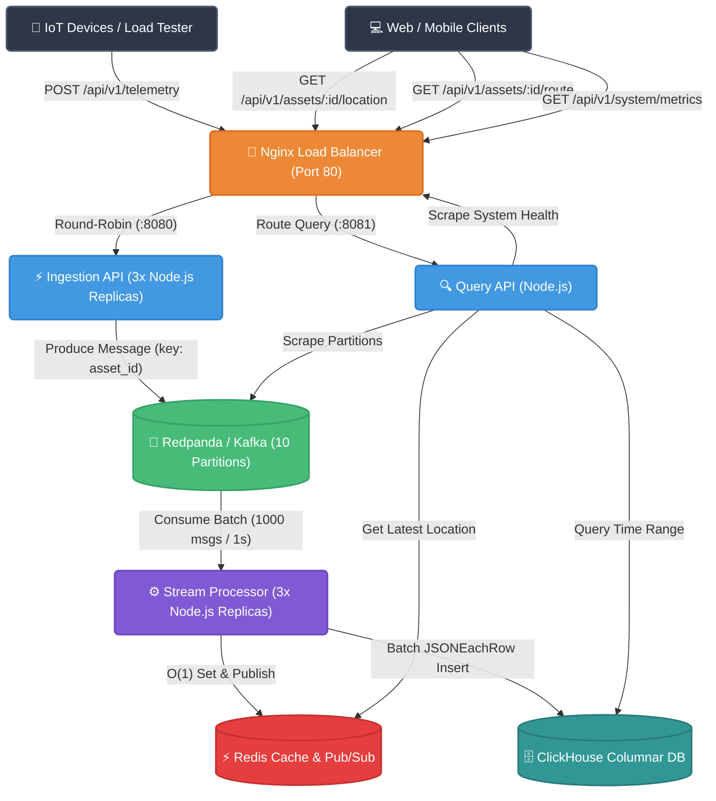
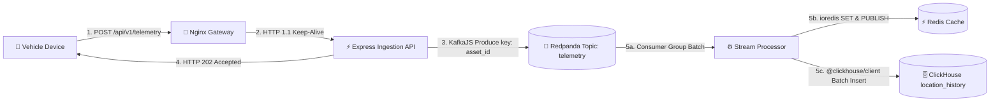
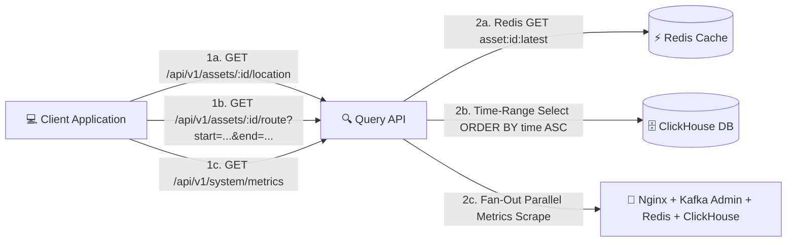

# Project Architecture Documentation (Updated Post-Migration)

## 1. Overview
- **Project Name:** Fleet Tracker (High-Throughput Fleet Tracking Backend)
- **Purpose:** A distributed, event-driven time-series ingestion and querying backend designed to process high-frequency GPS telemetry (latitude, longitude, timestamp) from tens of thousands of concurrent active fleet vehicles with low latency, high availability, and zero data loss.
- **Tech Stack:**
  - **Runtime & Language:** Node.js 20 LTS (v20-alpine) & TypeScript 5.3.3
  - **HTTP Framework:** Express (`express` 4.18.2)
  - **API Gateway & Load Balancer:** Nginx (Layer 7 reverse proxy & round-robin load balancer)
  - **Message Broker & Streaming:** Redpanda / Kafka (10-partition topic) via `kafkajs` 2.2.4
  - **In-Memory Cache & Pub/Sub:** Redis 7 via `ioredis` 5.3.2
  - **Analytical Database:** ClickHouse 24.3 (Columnar store, `ReplacingMergeTree` & `AggregatingMergeTree`) via `@clickhouse/client` 1.0.0
  - **Monorepo Management:** npm Workspaces (`@fleet-tracker/shared`, `@fleet-tracker/ingestion-api`, `@fleet-tracker/stream-processor`, `@fleet-tracker/query-api`)
  - **Containerization & Orchestration:** Docker & Docker Compose
  - **Load Testing & Observability:** Multi-threaded Go load generator (`cmd/loadtest`) and real-time system metrics endpoint.
- **High-Level Summary:**
  The High-Throughput Fleet Tracking System implements a Command Query Responsibility Segregation (CQRS) event-driven architecture to isolate high-volume write operations from low-latency read requests. Incoming telemetry data from IoT devices or load testers is reverse-proxied by Nginx across three Node.js/Express Ingestion API microservice replicas, which validate payloads and asynchronously publish events to a 10-partition Redpanda/Kafka topic. Scalable Stream Processor workers consume telemetry in batches (1,000 messages or 1-second window), maintaining real-time vehicle state in Redis and performing bulk transaction inserts into ClickHouse columnar storage for long-term historical route tracking. Query API microservices serve real-time asset locations from Redis and historical route data from ClickHouse while serving a unified system health and metrics dashboard.

---

## 2. Migration Summary

| Aspect | Before (`ARCHITECTURE.md`) | After (this document) | Changed? |
|---|---|---|---|
| Language / Runtime | Go 1.25 | Node.js 20 LTS / TypeScript 5.3.3 | ✅ |
| HTTP Framework | Gin Web Framework (`gin-gonic/gin`) | Express (`express` 4.18.2) | ✅ |
| Database Engine | TimescaleDB (PostgreSQL 15 extension) | ClickHouse 24.3 (`ReplacingMergeTree`) | ✅ |
| DB Connection / Client | `pgx/v5` (`pgxpool`) | `@clickhouse/client` (HTTP client) | ✅ |
| Kafka Client Library | `segmentio/kafka-go` | `kafkajs` | ✅ |
| Redis Client Library | `redis/go-redis/v9` | `ioredis` | ✅ |
| Project Layout | Monolithic Go module (`internal/`, `cmd/`) | npm Workspaces monorepo (`src/shared`, `src/services/*`) | ✅ |
| Kafka Topic & Partitioning | 10 partitions, `key = asset_id` | 10 partitions, `key = asset_id` | ❌ Unchanged |
| Redis Key & Pub/Sub | `asset:{id}:latest` (24h TTL), `telemetry_updates` | `asset:{id}:latest` (24h TTL), `telemetry_updates` | ❌ Unchanged |
| Nginx Routing & Gateway | Port 80, upstream clusters `:8080` & `:8081` | Port 80, upstream clusters `:8080` & `:8081` | ❌ Unchanged |
| Public API Contract | 4 endpoints (`POST /telemetry`, `GET /location`, `GET /route`, `GET /metrics`) | 4 endpoints (identical HTTP paths, verbs, schemas, status codes) | ❌ Unchanged |
| Write Idempotency Mechanism | Postgres `UNIQUE (asset_id, time) ON CONFLICT DO NOTHING` | ClickHouse `ReplacingMergeTree(ingested_at)` (asynchronous background merge) | ⚠️ Mechanism changed; deduplication is eventual |

---

## 3. Folder Structure

```
high-throughput-tracker-backend/
├── package.json                         → Root package definition configuring npm workspaces
├── tsconfig.json                        → Base TypeScript compiler configuration
├── docs/                                → API Contract documentation
│   ├── api-contract.md                  → Frozen HTTP API request/response specification
│   └── openapi.yaml                     → OpenAPI 3.0 YAML specification
├── db/                                  → Database DDL initialization scripts
│   ├── init.clickhouse.sql              → ClickHouse DDL (assets, location_history, hourly_asset_stats, MV)
│   └── init.sql                         → Legacy TimescaleDB DDL (retained for baseline diffs)
├── api-gateway/                         → Nginx reverse proxy configuration & Dockerfile
│   ├── Dockerfile                       → Nginx container image build
│   └── nginx.conf                       → Nginx configuration routing /api/v1/telemetry and /api/v1/
├── src/                                 → Node.js TypeScript Monorepo Source Code
│   ├── shared/                          → Shared domain models, ports, and infrastructure adapters (@fleet-tracker/shared)
│   │   ├── package.json
│   │   ├── tsconfig.json
│   │   └── src/
│   │       ├── domain/
│   │       │   ├── models.ts            → Asset & Telemetry interface definitions
│   │       │   ├── ports.ts             → TelemetryProducer, TelemetryCache, TelemetryStorage ports
│   │       │   └── __tests__/           → Domain model unit tests
│   │       ├── adapters/
│   │       │   ├── kafka/
│   │       │   │   ├── producer.ts      → KafkaJS Producer adapter (key-partitioned by asset_id)
│   │       │   │   └── consumer.ts      → KafkaJS Consumer adapter (batching 1,000 msgs / 1s)
│   │       │   ├── clickhouse/
│   │       │   │   └── storage.ts       → ClickHouse storage adapter (batch insert, route query, metrics)
│   │       │   ├── redis/
│   │       │   │   └── cache.ts         → Redis cache adapter (set/get location, Pub/Sub, metrics)
│   │       │   └── __tests__/           → Adapter serialization unit tests
│   │       └── index.ts                 → Public module exports
│   └── services/                        → Express Microservices Workspace
│       ├── ingestion-api/               → Ingestion API service (@fleet-tracker/ingestion-api)
│       │   ├── Dockerfile               → Docker image build (node:20-alpine)
│       │   ├── package.json
│       │   ├── tsconfig.json
│       │   └── src/
│       │       └── index.ts             → Express HTTP server binding POST /api/v1/telemetry
│       ├── stream-processor/            → Stream Processor worker service (@fleet-tracker/stream-processor)
│       │   ├── Dockerfile               → Docker image build (node:20-alpine)
│       │   ├── package.json
│       │   ├── tsconfig.json
│       │   └── src/
│       │       └── index.ts             → Background Kafka batch consumer loop
│       └── query-api/                   → Query API service (@fleet-tracker/query-api)
│           ├── Dockerfile               → Docker image build (node:20-alpine)
│           ├── package.json
│           ├── tsconfig.json
│           └── src/
│               └── index.ts             → Express HTTP server binding location, route, and system metrics endpoints
├── cmd/                                 → Benchmarking tools
│   └── loadtest/                        → Go load testing utility
│       ├── Dockerfile                   → Docker image build for load generator
│       └── main.go                      → Multi-threaded load generator (200 workers, ClickHouse asset seed via HTTP)
├── docker-compose.yml                   → Full stack container topology (ClickHouse, Redpanda, Redis, Nginx, Node services)
├── ARCHITECTURE.md                      → Pre-migration historical documentation (untouched)
├── ARCHITECTURE_UPDATED.md              → This document (post-migration architecture)
└── README.md                            → Project overview & benchmark metrics
```

---

## 4. Component Breakdown

### 1. API Gateway (`api-gateway/`)
- **Technology:** Nginx (Alpine base)
- **Role:** Central entry point for all external client traffic on port 80.
- **Routing Rules:**
  - `POST /api/v1/telemetry` → Proxy pass to `ingestion_cluster` (`ingestion-api-1:8080`, `ingestion-api-2:8080`, `ingestion-api-3:8080`) via round-robin with HTTP keep-alive connections.
  - `GET /api/v1/*` → Proxy pass to `query_cluster` (`query-api:8081`).
  - `GET /nginx_status` → Exposes Nginx stub status metrics for system health scraping.

### 2. Ingestion API (`src/services/ingestion-api/`)
- **Technology:** Node.js 20, Express, `kafkajs`
- **Role:** High-speed command handler for receiving incoming IoT telemetry.
- **Behavior:**
  - Listens on HTTP port `8080`.
  - Validates request body fields (`asset_id`, `latitude`, `longitude`).
  - Stamps server UTC timestamp (`new Date().toISOString()`).
  - Delegates publishing to `KafkaProducer` with `key: asset_id` on the `telemetry` topic.
  - Returns `202 Accepted` immediately without awaiting database persistence.

### 3. Stream Processor (`src/services/stream-processor/`)
- **Technology:** Node.js 20, `kafkajs`, `@clickhouse/client`, `ioredis`
- **Role:** Event consumer worker running in background processing loops.
- **Behavior:**
  - Subscribes to `telemetry` topic under consumer group `stream-processor-group`.
  - Fetches batches using 1,000-message or 1-second timeout thresholds.
  - Performs bulk `JSONEachRow` insert into ClickHouse `location_history` table.
  - Updates Redis cache key `asset:{id}:latest` with 24-hour TTL and publishes to `telemetry_updates` channel.
  - Resolves offsets and triggers offset commits after successful database and cache updates.

### 4. Query API (`src/services/query-api/`)
- **Technology:** Node.js 20, Express, `ioredis`, `@clickhouse/client`, `kafkajs`
- **Role:** Read-side query handler and observability aggregator.
- **Behavior:**
  - Listens on HTTP port `8081`.
  - `GET /api/v1/assets/:id/location` → Performs `O(1)` Redis lookup for `asset:{id}:latest`.
  - `GET /api/v1/assets/:id/route?start=...&end=...` → Executes parameterized query against ClickHouse `location_history` sorted by `time ASC`.
  - `GET /api/v1/system/metrics` → Fans out parallel metrics requests to ClickHouse (`system.parts`), Redis (`INFO`), Kafka Admin API, and Nginx stub status.

### 5. Shared Monorepo Core (`src/shared/`)
- **Technology:** TypeScript module `@fleet-tracker/shared`
- **Role:** Decouples domain logic from specific driver libraries using the Ports and Adapters (Hexagonal) architectural pattern.
- **Exports:**
  - `Asset` & `Telemetry` models ([models.ts](file:///d:/projects/through-put-using-kafka/high-throughput-tracker-backend/src/shared/src/domain/models.ts))
  - `TelemetryProducer`, `TelemetryCache`, `TelemetryStorage` interfaces ([ports.ts](file:///d:/projects/through-put-using-kafka/high-throughput-tracker-backend/src/shared/src/domain/ports.ts))
  - `KafkaProducer` & `KafkaConsumer` adapters ([kafka/](file:///d:/projects/through-put-using-kafka/high-throughput-tracker-backend/src/shared/src/adapters/kafka/))
  - `ClickHouseStorage` adapter ([clickhouse/storage.ts](file:///d:/projects/through-put-using-kafka/high-throughput-tracker-backend/src/shared/src/adapters/clickhouse/storage.ts))
  - `RedisCache` adapter ([redis/cache.ts](file:///d:/projects/through-put-using-kafka/high-throughput-tracker-backend/src/shared/src/adapters/redis/cache.ts))

### 6. Database & Initialization (`db/init.clickhouse.sql`)
- **Technology:** ClickHouse 24.3 Server
- **Role:** High-performance columnar storage engine optimized for time-series telemetry.
- **Tables & Views:**
  - `assets`: `ReplacingMergeTree(created_at) ORDER BY id`
  - `location_history`: `ReplacingMergeTree(ingested_at) PARTITION BY toYYYYMMDD(time) ORDER BY (asset_id, time) TTL toDateTime(time) + INTERVAL 6 MONTH DELETE`
  - `hourly_asset_stats`: `AggregatingMergeTree() PARTITION BY toYYYYMM(hour) ORDER BY (asset_id, hour)`
  - `hourly_asset_stats_mv`: Materialized View aggregating `ping_count`, `last_lat`, and `last_lng` via `argMaxState`.

---

## 5. Architecture Diagrams

### System Topology Diagram



### Write Path Micro-Diagram



### Read Path Micro-Diagram



---

## 6. Data Flow Explanation

### 1. Write Path Flow (Command Side)
1. **Request Ingestion:** An IoT client or load generator sends a `POST` request to `http://<host>/api/v1/telemetry` with body `{"asset_id": "asset-42", "latitude": 37.7749, "longitude": -122.4194}`.
2. **Reverse Proxying:** Nginx receives the request on port 80 and round-robins it to one of three `ingestion-api` replicas on internal port 8080.
3. **Validation & UTC Stamping:** The Express handler validates the payload fields and stamps `timestamp: new Date().toISOString()`.
4. **Kafka Publishing:** `KafkaProducer.produce()` serializes the object to JSON and emits a message to the `telemetry` topic using `asset_id` as the message key.
5. **Asynchronous Response:** The Ingestion API immediately responds with `HTTP 202 Accepted` (`{"status": "accepted"}`).
6. **Batch Consumption:** The `stream-processor` worker pool consumes messages from Kafka. KafkaJS accumulates up to 1,000 messages or waits 1 second.
7. **ClickHouse Bulk Persistence:** The worker transforms the batch into array rows and executes a single HTTP bulk `JSONEachRow` insert into ClickHouse `location_history`.
8. **Redis Cache & Pub/Sub Update:** For each item in the batch, the worker sets `asset:{id}:latest` with a 24-hour TTL in Redis and publishes the payload to channel `telemetry_updates`.
9. **Offset Commit:** Kafka offset checkpoints are committed after database and cache operations complete.

### 2. Read Path Flow (Query Side)
1. **Latest Location Query (`GET /api/v1/assets/:id/location`):**
   - Nginx routes the request to `query-api` on port 8081.
   - Query API executes `RedisCache.getLatestLocation(assetId)` (`O(1)` key lookup).
   - Returns `200 OK` with telemetry JSON, or `404 Not Found` if missing.
2. **Historical Route Query (`GET /api/v1/assets/:id/route?start=...&end=...`):**
   - Nginx routes request to `query-api`.
   - Query API validates `start` and `end` timestamps.
   - Executes parameterized query `SELECT time, asset_id, latitude, longitude FROM location_history WHERE asset_id = {assetId: String} AND time >= {start: String} AND time <= {end: String} ORDER BY time ASC`.
   - Returns `200 OK` JSON array.
3. **System Observability (`GET /api/v1/system/metrics`):**
   - Query API fans out 4 parallel asynchronous requests to:
     - ClickHouse system tables (`system.parts` and `system.processes`) for row counts, DB size, and compression multiplier.
     - Redis `INFO memory clients stats` and `DBSIZE`.
     - Redpanda Kafka Admin API for topic partition count and offset lag.
     - Nginx `http://api-gateway/nginx_status` stub status.
   - Aggregates results into JSON response.

---

## 7. External Dependencies & Integrations

### Node.js Monorepo Package Dependencies

| Package | Workspace | Version | Purpose |
|---|---|---|---|
| `express` | Services | `^4.18.2` | HTTP web application framework |
| `kafkajs` | Shared / Services | `^2.2.4` | Kafka producer & batch consumer client |
| `@clickhouse/client` | Shared | `^1.0.0` | Official ClickHouse HTTP client driver |
| `ioredis` | Shared | `^5.3.2` | High-performance Redis client with Pub/Sub & memory info support |
| `typescript` | Monorepo Root | `^5.3.3` | Static typing and compiler |
| `ts-node` | Services | `^10.9.2` | Execution engine for TypeScript files during development |
| `vitest` | Monorepo Root | `^1.2.0` | Unit test framework |

### Infrastructure Integration Summary
- **ClickHouse Server (`clickhouse/clickhouse-server:24.3-alpine`):** Listens on port 8123 (HTTP API) and 9000 (Native). Auto-executes `/docker-entrypoint-initdb.d/init.sql` on container startup.
- **Redpanda Broker (`docker.redpanda.com/redpandadata/redpanda:latest`):** Listens on port 9092 (internal) and 19092 (external). Topic `telemetry` initialized with 10 partitions.
- **Redis (`redis:7-alpine`):** Listens on port 6379. Used for key-value state and message broadcasting.
- **Nginx (`nginx:alpine`):** Listens on port 80 with upstream proxies to `ingestion_cluster` and `query_cluster`.

---

## 8. Entry Points & Lifecycles

### 1. Ingestion API Entry Point (`src/services/ingestion-api/src/index.ts`)
```ts
// 1. Environment parsing (KAFKA_BROKERS, KAFKA_TOPIC, PORT)
// 2. Instantiates KafkaProducer adapter from @fleet-tracker/shared
// 3. Initializes Express application & JSON middleware
// 4. Registers POST /api/v1/telemetry handler
// 5. Binds HTTP server listener on process.env.PORT || 8080
// 6. Registers SIGTERM shutdown hook closing HTTP server and Kafka producer
```

### 2. Stream Processor Entry Point (`src/services/stream-processor/src/index.ts`)
```ts
// 1. Environment parsing (KAFKA_BROKERS, KAFKA_TOPIC, KAFKA_GROUP, REDIS_ADDR, CLICKHOUSE_URL)
// 2. Instantiates ClickHouseStorage, RedisCache, and KafkaConsumer adapters
// 3. Invokes KafkaConsumer.start() loop with 1,000-message / 1-second batch handler
// 4. Batch handler calls storage.insertBatch(), cache.setLatestLocation(), and cache.publishLocation()
// 5. Registers SIGTERM hook gracefully disconnecting Kafka consumer, Redis, and ClickHouse clients
```

### 3. Query API Entry Point (`src/services/query-api/src/index.ts`)
```ts
// 1. Environment parsing (PORT, REDIS_ADDR, CLICKHOUSE_URL, KAFKA_BROKERS)
// 2. Instantiates ClickHouseStorage and RedisCache adapters
// 3. Binds GET /api/v1/assets/:id/location, GET /api/v1/assets/:id/route, and GET /api/v1/system/metrics
// 4. Binds HTTP server listener on process.env.PORT || 8081
// 5. Registers SIGTERM shutdown hook for graceful socket cleanup
```

---

## 9. Design Patterns Used

1. **CQRS (Command Query Responsibility Segregation):**
   - Complete architectural separation between the write path (`POST /telemetry` -> Ingestion API -> Kafka -> Stream Processor -> ClickHouse) and the read path (`GET /location`, `GET /route` -> Query API -> Redis / ClickHouse).
2. **Ports and Adapters (Hexagonal Architecture):**
   - Core domain logic and repository abstractions are defined in `@fleet-tracker/shared` ports (`TelemetryProducer`, `TelemetryCache`, `TelemetryStorage`). Specific infrastructure drivers (`kafkajs`, `ioredis`, `@clickhouse/client`) are isolated inside adapter classes.
3. **Producer-Consumer & Batch Processing Pattern:**
   - Kafka decouples ingestion rate from persistence write rate. Stream Processor workers process incoming telemetry in batches of up to 1,000 events or 1-second time windows, utilizing bulk `JSONEachRow` HTTP streams into ClickHouse for maximum write throughput.
4. **Reverse Proxy & Layer 7 Load Balancing:**
   - Nginx handles TLS termination, request routing, and round-robin load distribution across horizontal Ingestion API microservice replicas.
5. **Idempotent Receiver & Deduplication:**
   - **ClickHouse ReplacingMergeTree Engine:** Unlike Postgres, ClickHouse does not support standard `ON CONFLICT DO NOTHING` constraints. Idempotency is enforced by ClickHouse's `ReplacingMergeTree(ingested_at)` engine ordered by `(asset_id, time)`.
   - **Eventual Consistency Caveat:** Duplicate messages produced during rare consumer crashes or rebalances will temporarily coexist in storage parts before being asynchronously merged and deduplicated in the background by ClickHouse. Route queries execute in-order and duplicates self-heal automatically as background merges execute.
