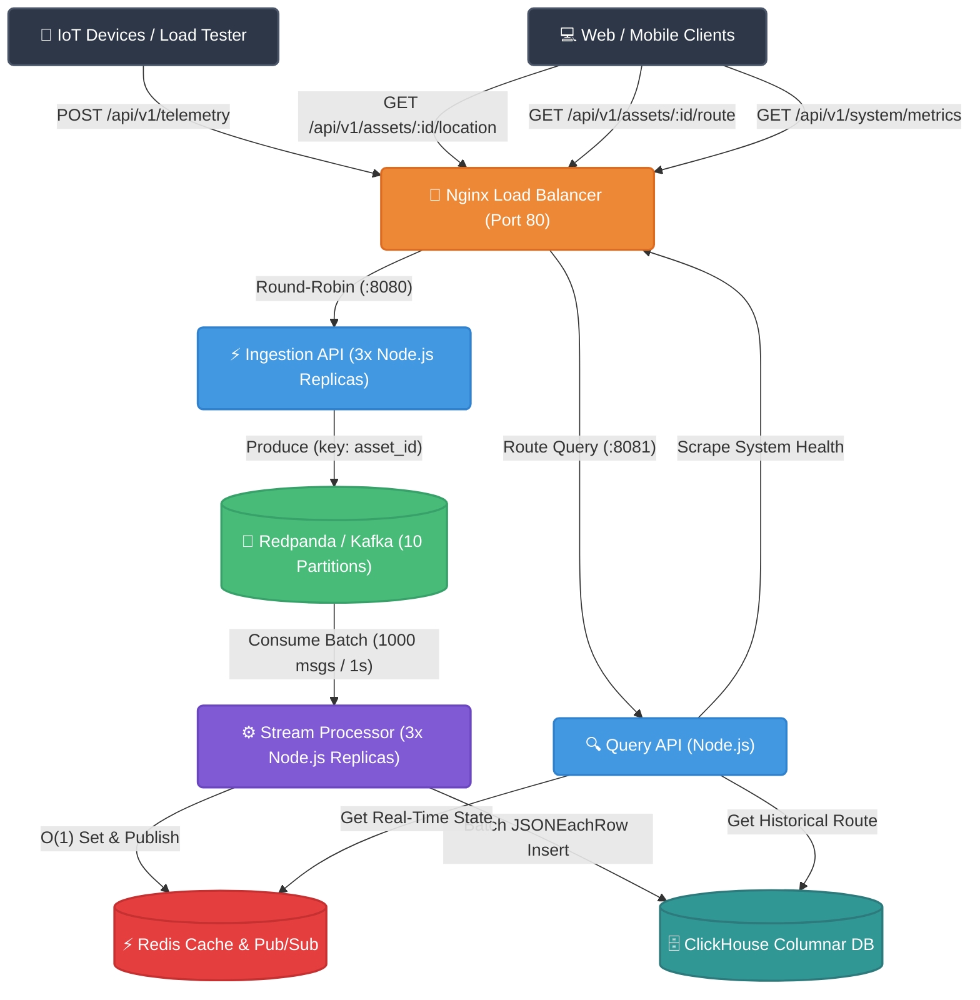

# High-Throughput Fleet Tracking System (CQRS Architecture)

A highly scalable, distributed backend system designed to ingest, process, and query real-time IoT telemetry data (GPS coordinates) from tens of thousands of active vehicles. Built in **Node.js + Express (TypeScript)** with **ClickHouse** as the ultra-fast columnar analytical database, this project implements the **CQRS (Command Query Responsibility Segregation)** pattern to achieve massive throughput with zero data loss.

---

## 🛠️ Technology Stack

- **Runtime & Language:** Node.js 20 LTS & TypeScript 5.3.3
- **HTTP Framework:** Express (`express` 4.18.2)
- **Analytical Database:** ClickHouse 24.3 (`ReplacingMergeTree` & `AggregatingMergeTree`)
- **Message Broker:** Redpanda / Kafka (10-partition topic) via `kafkajs` 2.2.4
- **In-Memory Cache & Pub/Sub:** Redis 7 via `ioredis` 5.3.2
- **API Gateway / Load Balancer:** Nginx (Layer 7 round-robin load balancing)
- **Monorepo Architecture:** npm Workspaces (`@fleet-tracker/shared`, `@fleet-tracker/ingestion-api`, `@fleet-tracker/stream-processor`, `@fleet-tracker/query-api`)
- **Containerization & Orchestration:** Docker & Docker Compose

---

## 🏗️ System Architecture



---

## 💡 Key Design Patterns

- **CQRS (Command Query Responsibility Segregation):** Isolates high-volume telemetry write operations (`/api/v1/telemetry`) from low-latency read queries (`/api/v1/assets/...`).
- **Repository / Adapter Pattern:** Core interfaces defined in `src/shared/src/domain/ports.ts` with driver adapters in `src/shared/src/adapters/` decoupling logic from specific DB/Queue drivers.
- **Producer-Consumer & Pub/Sub:** Asynchronous event delivery via 10-partition Kafka topic (`telemetry`) and real-time subscriber events on Redis channel `telemetry_updates`.
- **Batch Processing:** Drains Kafka queue in 1,000-message or 1-second batches and executes bulk `JSONEachRow` HTTP insertions into ClickHouse.
- **Idempotent Receiver:** Employs ClickHouse's `ReplacingMergeTree(ingested_at)` engine ordered by `(asset_id, time)` for asynchronous background deduplication.
- **Reverse Proxy & Load Balancing:** Nginx distributes incoming HTTP traffic evenly across three `ingestion-api` replicas over keep-alive connections.

> 📖 *Full architectural details, sequence flows, and component specs are available in [ARCHITECTURE_UPDATED.md](ARCHITECTURE_UPDATED.md).*

---

## 📋 Public API Reference

| Method | Endpoint Path | Description | Success Response |
|---|---|---|---|
| `POST` | `/api/v1/telemetry` | Ingest raw GPS telemetry ping from asset | `202 Accepted` |
| `GET` | `/api/v1/assets/:id/location` | Fetch latest real-time GPS location from Redis | `200 OK` (`404` if absent) |
| `GET` | `/api/v1/assets/:id/route` | Fetch historical location points (`start` & `end` query params) | `200 OK` (JSON Array) |
| `GET` | `/api/v1/system/metrics` | Scrape operational metrics across ClickHouse, Redis, Kafka, and Nginx | `200 OK` (JSON Dashboard) |

> 📑 *Complete payload definitions and status code specifications are frozen in [docs/api-contract.md](docs/api-contract.md) and [docs/openapi.yaml](docs/openapi.yaml).*

---

## 🚀 Quick Start

### 1. Prerequisites
- [Docker & Docker Compose](https://docs.docker.com/get-docker/)
- [Node.js 20 LTS](https://nodejs.org/) & `npm`

### 2. Workspace Setup & Build
Install monorepo dependencies and compile TypeScript modules:
```bash
npm install
npm run build
```

### 3. Spin Up Full Infrastructure & Application Stack
Launch ClickHouse, Redpanda/Kafka, Redis, 3 Ingestion replicas, 3 Stream Processor workers, Query API, and Nginx:
```bash
docker compose up -d --build
```
ClickHouse automatically initializes database schema, tables, and materialized views from `db/init.clickhouse.sql`.

### 4. Run the High-Concurrency Load Tester
Bombard the architecture with 200 concurrent Go load workers firing telemetry pings across 100,000 assets for 60 seconds:
```bash
docker compose --profile loadtest run --rm loadtest
```

---

## 📊 Performance Metrics

* **Go/TimescaleDB Baseline Throughput:** `~8,550 Requests / Second` (sustained 200-worker bombardment, 22ms average latency).
* **Node.js/ClickHouse Benchmark:** _Pending execution run on current stack — see `loadtest_results.log` after executing load tester profile._

---

## 📚 Documentation & Reference Links

- [ARCHITECTURE_UPDATED.md](ARCHITECTURE_UPDATED.md) — As-built architecture documentation for Node.js/Express + ClickHouse.
- [ARCHITECTURE.md](ARCHITECTURE.md) — Pre-migration historical documentation for Go + TimescaleDB baseline.
- [docs/api-contract.md](docs/api-contract.md) — Frozen API contract specification.
- [docs/openapi.yaml](docs/openapi.yaml) — OpenAPI 3.0 YAML specification.
